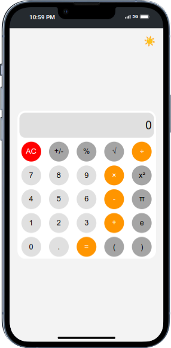
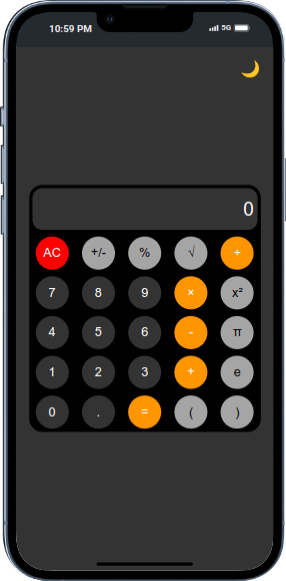
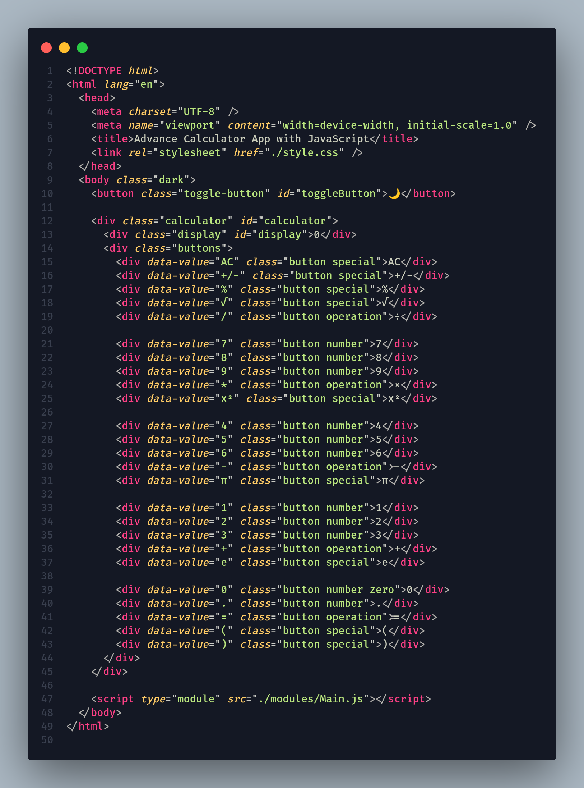
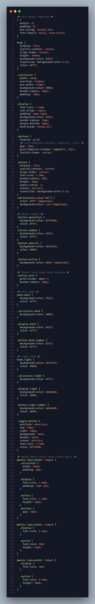
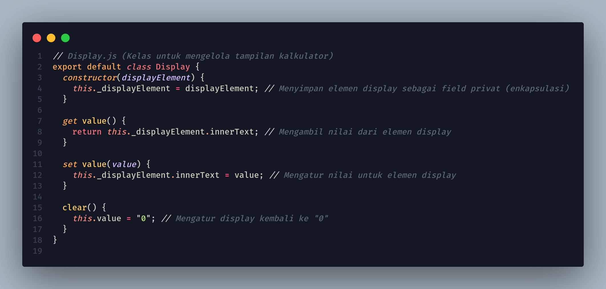
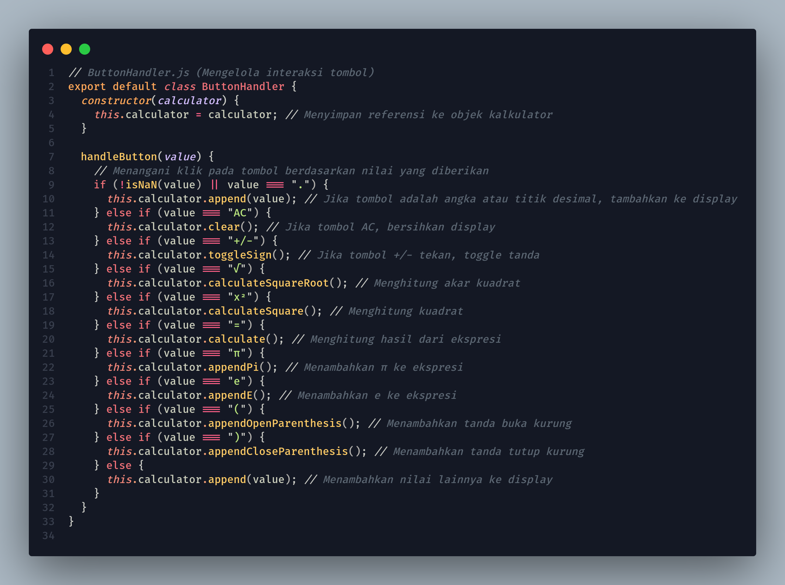
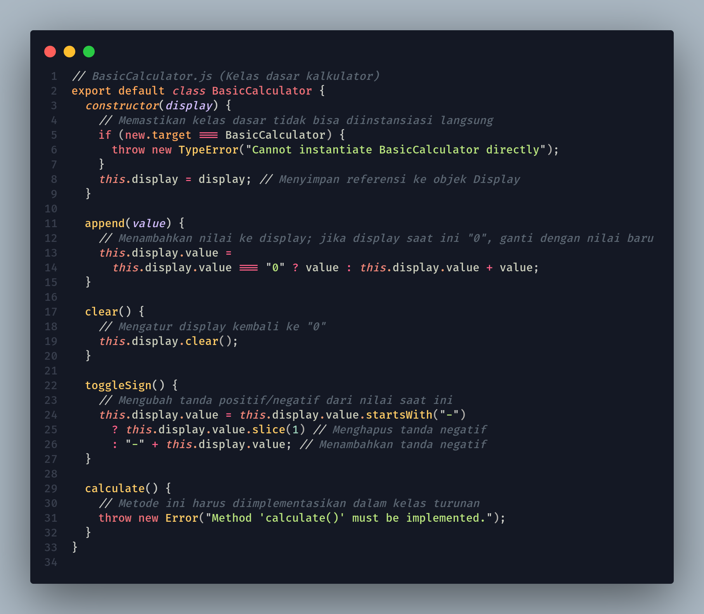
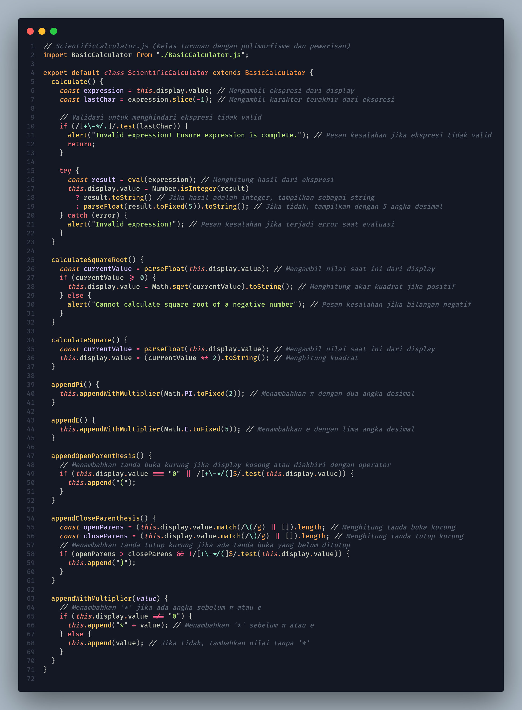
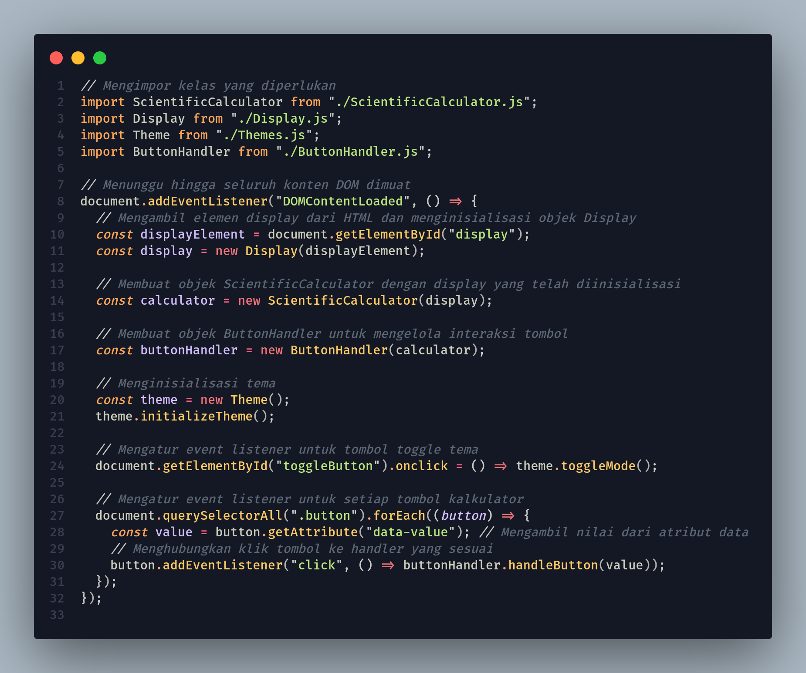
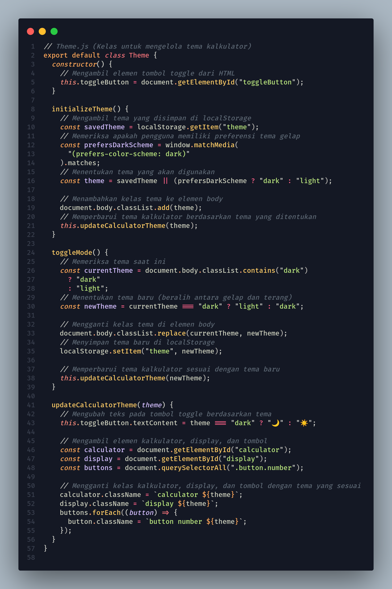

<div align="center">
<h1>Aplikasi Kalkulator Lanjutan dengan JavaScript</h1>
</div>
<div align="center">
 

</div>

## Daftar Isi

1. [Pendahuluan](#pendahuluan)
2. [Fitur](#fitur)
3. [Prasyarat](#prasyarat)
4. [Struktur Proyek](#struktur-proyek)
5. [Panduan Langkah demi Langkah](#panduan-langkah-demi-langkah)
   - [1. Menyiapkan Proyek](#1-menyiapkan-proyek)
   - [2. Membuat Struktur HTML](#2-membuat-struktur-html)
   - [3. Menata Kalkulator](#3-menata-kalkulator)
   - [4. Mengimplementasikan Kelas JavaScript](#4-mengimplementasikan-kelas-javascript)
   - [5. Menangani Klik Tombol](#5-menangani-klik-tombol)
   - [6. Mengimplementasikan Tema](#6-mengimplementasikan-tema)
6. [Kesimpulan](#kesimpulan)

## Pendahuluan

Proyek ini menunjukkan cara membuat aplikasi kalkulator lanjutan menggunakan JavaScript. Kalkulator ini mendukung operasi aritmatika dasar, fungsi ilmiah, dan penggantian tema.

## Fitur

- Operasi aritmatika dasar (penjumlahan, pengurangan, perkalian, pembagian)
- Fungsi ilmiah (akar kuadrat, kuadrat, π, e)
- Dukungan tanda kurung untuk ekspresi kompleks
- Mode tema terang dan gelap

## Prasyarat

- Pengetahuan dasar tentang HTML, CSS, dan JavaScript
- Editor kode (seperti VSCode)
- Browser web modern

## Struktur Proyek

```plaintext
/calculator-app
|-- index.html
|-- style.css
|-- /modules
|   |-- Main.js
|   |-- Display.js
|   |-- BasicCalculator.js
|   |-- ScientificCalculator.js
|   |-- ButtonHandler.js
|   |-- Theme.js
```

## Panduan Langkah demi Langkah

### 1. Menyiapkan Proyek

```plaintext
/calculator-app
|-- index.html
|-- style.css
|-- /modules
```

### 2. Membuat Struktur HTML

Di dalam file `index.html`, buat struktur dasar untuk kalkulator.



### 3. Styling Kalkulator

Di dalam file `style.css`, tambahkan beberapa gaya dasar untuk kalkulator:



### 4. Mengimplementasikan Kelas JavaScript

Di dalam direktori modules, buat file JavaScript berikut dan implementasikan kelas masing-masing.

#### `Display.js`



#### `ButtonHandler.js`



#### `BasicCalculator.js`



#### `ScientificCalculator.js`



### 5. Menangani Klik Tombol

Di dalam `main.js`, hubungkan tombol HTML ke logika kalkulator dengan membuat event listener untuk setiap tombol.



### 6. Mengimplementasikan Tema

Di dalam `Themes.js`, tambahkan fungsionalitas untuk mengganti antara tema terang dan gelap.



## 6. Kesimpulan

Berikut adalah kesimpulan dari struktur modul aplikasi kalkulator lanjutan dengan JavaScript:

### Kesimpulan

Aplikasi kalkulator lanjutan ini dirancang untuk memberikan pengalaman pengguna yang interaktif dan mendukung berbagai operasi matematis. Dengan fitur-fitur seperti operasi aritmatika dasar, fungsi ilmiah, dan kemampuan untuk mengganti tema, aplikasi ini dirancang agar mudah digunakan dan intuitif.

Struktur proyek terdiri dari beberapa komponen penting, termasuk:

1. **Pendahuluan dan Fitur**: Menyediakan gambaran umum tentang aplikasi dan fitur-fitur utamanya, seperti penjumlahan, pengurangan, perkalian, pembagian, serta fungsi ilmiah seperti akar kuadrat dan konstanta matematika π dan e.

2. **Prasyarat**: Menggarisbawahi pengetahuan yang diperlukan untuk mengembangkan aplikasi ini, termasuk pemahaman dasar tentang HTML, CSS, dan JavaScript.

3. **Struktur Proyek**: Menyajikan organisasi file yang jelas, termasuk file HTML, CSS, dan modul JavaScript terpisah yang mengatur logika aplikasi, termasuk pengelolaan tampilan, penanganan tombol, kalkulator dasar, dan kalkulator ilmiah.

4. **Panduan Langkah demi Langkah**: Menawarkan instruksi terperinci untuk setiap tahap pengembangan, mulai dari menyiapkan proyek hingga implementasi kelas JavaScript untuk fungsi kalkulator.

5. **Modul Kelas**:
   - `Display.js` mengelola tampilan kalkulator.
   - `ButtonHandler.js` menangani interaksi pengguna dengan tombol kalkulator.
   - `BasicCalculator.js` berfungsi sebagai kelas dasar untuk operasi dasar.
   - `ScientificCalculator.js` memperluas `BasicCalculator` untuk menambahkan fungsionalitas ilmiah.
   - `Theme.js` mengelola penggantian tema antara mode terang dan gelap.

Dengan struktur modul yang terorganisir, aplikasi ini tidak hanya dapat dengan mudah dikembangkan dan dipelihara, tetapi juga memungkinkan pengembang untuk menambahkan lebih banyak fitur di masa depan. Melalui implementasi ini, pengguna dapat melakukan perhitungan kompleks dengan cara yang lebih menyenangkan dan responsif.
